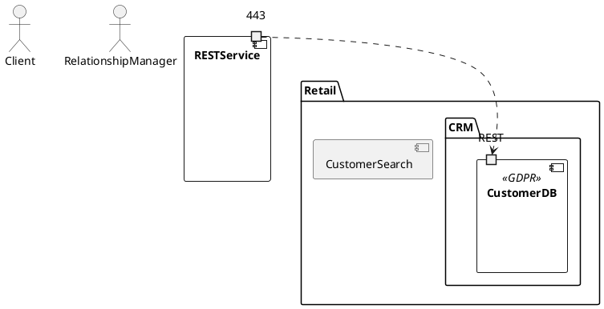

# SofaMan


SofaMan is an easy to use software architecture modeling language inspired by YAML. 
It is designed to be easy to read and write, and to be easily converted to other modeling language formats.
At present there are two languages supported, XMI (UML2) and PlantUML.

The project uses [Pixi](https://pixi.sh/latest/) for project management.

## Example

The following shows an example model using the SofaMan modeling language.

```
#
# Sample sofa model.
#

package Retail.CRM:
    visibility: public

stereotype Regulatory: [GDPR]
stereotype Security: [PIDRelevant]

actor Client
actor RelationshipManager

component RESTService:
    ports: [443]

component CustomerDB:
    name: Customer Database
    description:|
        Holds customer data
    stereotypes: [Regulatory.GDPR]
    package: Retail.CRM
    ports: [443, REST]

component CustomerSearch(RESTService):
    package: Retail
    ports: [443]

relation CustomerSearch@443 flow CustomerDB@REST:
    name: Execute search query
    description: |
        Search for customers by name or address
    stereotypes: [Regulatory.GDPR]


```

The above model generates the following PUML.



All the supported modeling syntax can be found in `tests/test_cases/full_all.sofa`

## Usage

### Run

```
pixi run python sofaman/sofamangen.py --help
```

### Run tests

```
pixi run test
```

### Test coverage
```
pixi run coverage
```

### Documentation
```
pixi run doc
```

The latest documentation can be found at: https://ruhati.net/sofaman/
